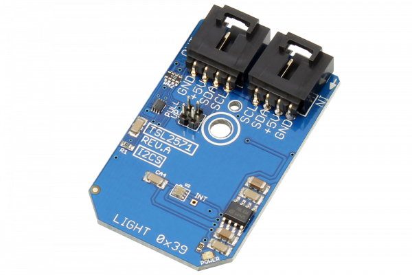

# TSL2571

The TSL2571 is a light-to-digital device with, on-chip photo-diodes, integrating amplifiers, ADCs and a 400 kHz I2C interface.  Packaged into a convenient I2C Mini Module, the TSL2571 provides ambient light sensing (ALS) that approximates human eye response to light intensity under a variety of lighting conditions and through a variety of attenuation materials.  
This Device is available from www.ncd.io 

[SKU: TSL2571]

(https://store.ncd.io/product/tmp112-temperature-sensor-%C2%B1-5c-12-bit-i2c-mini-module/)
This Sample code can be used with Arduino.

Hardware needed to interface TSL2571 sensor with Arduino

1. <a href="https://store.ncd.io/product/i2c-shield-for-arduino-nano/">Arduino Nano</a>

2. <a href="https://store.ncd.io/product/i2c-shield-for-arduino-micro-with-i2c-expansion-port/">Arduino Micro</a>

3. <a href="https://store.ncd.io/product/i2c-shield-for-arduino-uno/">Arduino uno</a>

4. <a href="https://store.ncd.io/product/dual-i2c-shield-for-arduino-due-with-modular-communications-interface/">Arduino Due</a>

5. <a href="https://store.ncd.io/product/tsl2571-light-to-digital-converter-programmable-analog-gain-i2c-mini-module/">TSL2571 Light To Digital Converter Sensor</a>

6. <a href="https://store.ncd.io/product/i%C2%B2c-cable/">I2C Cable</a>

TSL2571:

The TSL2571 is a light-to-digital device with, on-chip photo-diodes, integrating amplifiers, ADCs and a 400 kHz I2C interface.  Packaged into a convenient I2C Mini Module, the TSL2571 provides ambient light sensing (ALS) that approximates human eye response to light intensity under a variety of lighting conditions and through a variety of attenuation materials.  

Applications:

• Display Management

• Backlight Control

• Portable Device Power Optimization

• Cell Phones, PDA, GPS

• Notebooks and Monitors

• LCD TVs

How to Use the TSL2571 Arduino Library

The TSL2571 has a number of settings, which can be configured based on user requirements.
          
1.One shot mode:The following command is used to DISABLE the one shot mode..

            tsl.setATime(ATIME_2_72MS);                 // Cycles: 1, Time: 2.72 ms Max Count: 1024
            
2.Wait time setting:The following command is used to set the wait timek..

            tsl.setWTime(WTIME_1);                      // Wait Time: 1, Time (WLONG = 0): 2.72 ms Time (WLONG = 1):  0.032 sec
                   
3.ALS gain setting:The following command is used to  set the ALS gain of sensor.           
          
             tsl.setALSGain(AGAIN_1X);                   // ALS Gain: 1X
            
